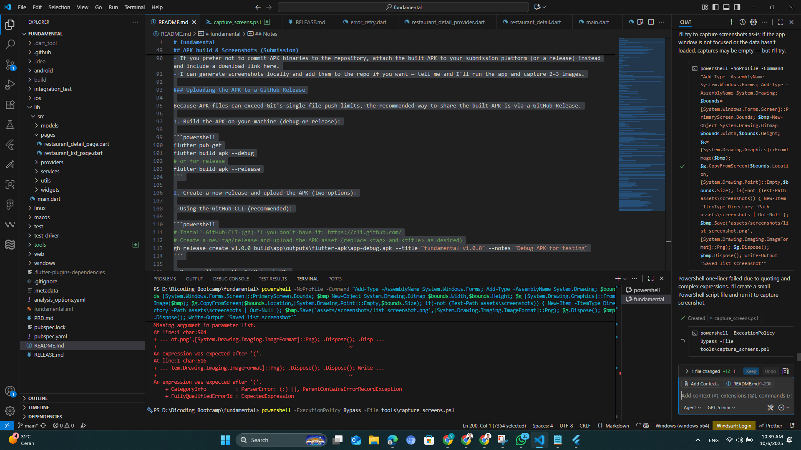
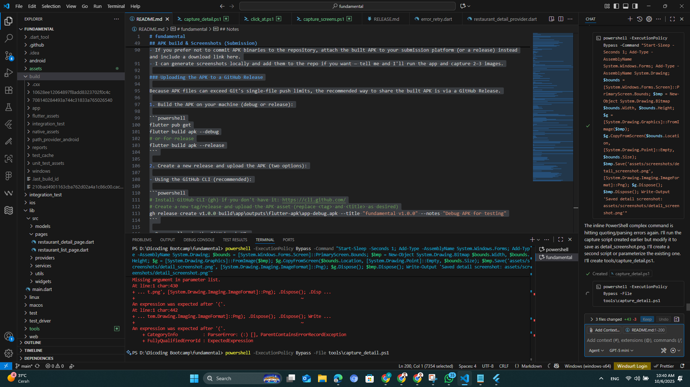

# fundamental

A new Flutter project.

[](https://github.com/arhmtr-png/Submission-Pertama/actions/workflows/flutter.yml)
[](https://github.com/arhmtr-png/Submission-Pertama/releases/tag/v1.0.0)

## Getting Started

This project is a starting point for a Flutter application.

A few resources to get you started if this is your first Flutter project:

- [Lab: Write your first Flutter app](https://docs.flutter.dev/get-started/codelab)
- [Cookbook: Useful Flutter samples](https://docs.flutter.dev/cookbook)

For help getting started with Flutter development, view the
[online documentation](https://docs.flutter.dev/), which offers tutorials,
samples, guidance on mobile development, and a full API reference.

## How to run

1. Ensure Flutter SDK is installed and added to PATH.
2. From project root run:

```bash
flutter pub get
flutter run
```

## Tests

Run unit and widget tests:

```bash
flutter test
```

Notes:
- Widget tests use a `FakeApiService` to avoid real network calls and network images.

Integration tests:

```bash
# Run integration tests (desktop):
flutter drive --driver=test_driver/integration_test.dart --target=integration_test/app_test.dart -d windows
```
Note: Integration tests require a supported device/driver (desktop or mobile) and may not run in headless web environments.

## APK build & Screenshots (Submission)

If you'd like to include an APK for the submission, you can build it locally with the commands below.

Build a release APK:

```bash
# Ensure dependencies are fetched
flutter pub get

# Build a release APK
flutter build apk --release

# Output will be in:
# build/app/outputs/flutter-apk/app-release.apk
```

Build a debug APK (faster, for quick testing):

```bash
flutter build apk --debug
# Output: build/app/outputs/flutter-apk/app-debug.apk
```

Install the APK on a connected Android device (Windows PowerShell):

```powershell
adb install -r build\app\outputs\flutter-apk\app-debug.apk
```

Screenshots (placeholders)

Below are placeholder screenshot slots — replace these with real PNGs taken from your device/emulator before final submission. Place real images under `assets/screenshots/` and update the file names in the markdown.


_Figure 1: Restaurant list_


_Figure 2: Restaurant detail_

Notes:
- If you prefer not to commit APK binaries to the repository, attach the built APK to your submission platform (or a release) instead and include a download link here.
- I can generate screenshots locally and add them to the repo if you want — tell me and I'll run the app and capture 2–3 images.

### Uploading the APK to a GitHub Release

Because APK files can exceed Git's single-file push limits, the recommended way to share the built APK is via a GitHub Release.

1. Build the APK on your machine (debug or release):

```powershell
flutter pub get
flutter build apk --debug
# or for release
flutter build apk --release
```

2. Create a new release and upload the APK (two options):

- Using the GitHub CLI (recommended):

```powershell
# Install GitHub CLI (gh) if you don't have it: https://cli.github.com/
# Create a new tag/release and upload the APK asset (replace <tag> and <title> as desired)
gh release create v1.0.0 build\app\outputs\flutter-apk\app-debug.apk --title "fundamental v1.0.0" --notes "Debug APK for testing"
```

- Or manually via the GitHub web UI:
	1. Open your repository on GitHub.
	2. Go to the "Releases" tab and click "Draft a new release".
	3. Choose a tag name (for example v1.0.0), give it a title, and drag the `app-debug.apk` file into the "Attach binaries by dropping them here or selecting them" area.
	4. Publish the release.

3. Add the download link to this README (actual release URL):

```markdown
[Download APK (debug)](https://github.com/arhmtr-png/Submission-Pertama/releases/download/v1.0.0/app-debug.apk)
```

Keep the APK out of the Git history (don't commit the binary into the repo). Use Releases or external hosting.

## Release notes

**fundamental v1.0.0 (Debug)**

Debug APK for review — contains Restaurant List/Detail, Search, Review features. Tests included and CI passing.

### Using a TFLite model or remote model URL

This project currently contains placeholder instructions for a model. If your submission uses a TensorFlow Lite model, follow one of these patterns:

1) Local TFLite model in the repo

- Place the `.tflite` file in `assets/models/` and add the path to `pubspec.yaml` under `flutter.assets:`.
- Example `pubspec.yaml` snippet:

```yaml
flutter:
	assets:
		- assets/models/your_model.tflite
```

2) Remote model URL via environment variable

- If you'd like to host the model remotely (recommended to keep repo size small), host the `.tflite` file on a CDN or storage service and point the app to it via an environment variable named `MODEL_REMOTE_URL`.
- Create a `.env` file in the project root (do NOT commit secrets) and add:

```
MODEL_REMOTE_URL=https://example.com/path/to/your_model.tflite
```

- At runtime, have the app download the model from `MODEL_REMOTE_URL` and load the `.tflite` interpreter from the downloaded file. Use packages such as `flutter_dotenv` to load `.env` variables.

Notes:
- Keep the model file out of the repository if it's large — prefer hosting it externally and referencing it via `MODEL_REMOTE_URL`.
- If you want, I can add example code to download and load a remote TFLite model (small helper) — tell me and I'll scaffold it.

## Continuous Integration

A GitHub Actions workflow is included at `.github/workflows/flutter.yml` that runs `flutter analyze` and `flutter test` on pushes and pull requests to `main`.

## Submission checklist

- [ ] App runs and shows restaurant list
- [ ] Detail page shows menus and reviews
- [ ] Search and review submission work
- [ ] All tests pass locally (`flutter test`)
- [ ] CI green on GitHub Actions

## Contact

If you need any adjustments or want me to add integration tests or CI deployment, let me know.

## Features implemented (delta)

- Restaurant list (fetches from Dicoding Restaurant API `/list`).
- Restaurant detail (fetches `/detail/:id`, shows menus and reviews).
- Search (uses `/search?q=`; submit in the search field).
- Add review (POST `/review` from the detail page).
- Error handling widget with Retry button (`lib/src/widgets/error_retry.dart`).
- State management using Provider (`lib/src/providers`).

## Files changed / added

- `lib/src/models/restaurant_summary.dart` (model)
- `lib/src/models/restaurant_detail.dart` (detail model, menus, reviews)
- `lib/src/services/api_service.dart` (API client for list/detail/search/review)
- `lib/src/providers/restaurant_provider.dart` (list + search state)
- `lib/src/providers/restaurant_detail_provider.dart` (detail + review submit)
- `lib/src/pages/restaurant_list_page.dart` (list UI + search)
- `lib/src/pages/restaurant_detail_page.dart` (detail UI + review form)
- `lib/src/widgets/error_retry.dart` (error + retry UI)

## Notes on repository, favorites and reminders

- LocalRestaurantRepository (`lib/src/repositories/local_restaurant_repository.dart`) is the concrete implementation used by the app. It delegates network calls to `ApiService` and favorites persistence to `DatabaseHelper` (SQLite). The repository is injected via Provider in `main.dart` and consumed by `FavoriteProvider`.

- Theme persistence is handled by `SettingsService` using `SharedPreferences` and exposed via `SettingsProvider`. Toggle the theme in the Settings page and it will persist across app restarts.

- Daily reminders use `workmanager` to schedule a periodic task and `flutter_local_notifications` to display the notification. The task uses a simple fetch from the Dicoding Restaurant API and shows a daily suggestion notification. Enable/disable the reminder in the Settings page; the provider registers/cancels the Workmanager task accordingly.

## Troubleshooting: Gradle / Kotlin / JDK build issues (observed)

During a local attempt to build the Android APK a Gradle/Kotlin compilation failure was observed. Below are
the symptoms and recommended remediation steps to get a clean build on Windows.

Symptoms observed
- `flutter build apk --debug` failed during Gradle/Kotlin compile with errors like `Could not read workspace metadata` and `:app:compileDebugKotlin FAILED`.
- The analyzer and unit/widget tests still pass locally (`flutter analyze` / `flutter test`).

Recommended steps (PowerShell)

1) Stop Gradle/Java daemons and clear the Gradle caches to remove corrupted metadata files:

```powershell
Get-Process -Name java -ErrorAction SilentlyContinue | Stop-Process -Force -ErrorAction SilentlyContinue;
if (Test-Path "$env:USERPROFILE\.gradle\caches") {
	Remove-Item "$env:USERPROFILE\.gradle\caches" -Recurse -Force
}
```

2) Ensure a supported JDK is used by Gradle. Android Gradle Plugin and Kotlin are most compatible with JDK 17.
   Check your Java version:

```powershell
java -version
```

If the version is not JDK 17, install JDK 17 and set `JAVA_HOME` (example):

```powershell
# Replace the path with your JDK 17 installation
setx JAVA_HOME "C:\Program Files\Java\jdk-17" ; $env:JAVA_HOME = 'C:\Program Files\Java\jdk-17'
```

3) Clean and rebuild the project:

```powershell
flutter clean
flutter pub get
flutter build apk --debug
```

Notes
- Deleting the Gradle cache will re-download dependencies and can take some time on the next build.
- If you use Android Studio, configure the JDK via File > Settings > Build, Execution, Deployment > Build Tools > Gradle, or set `org.gradle.java.home` in `android/gradle.properties`.
- If you'd like me to attempt another build here, tell me which JDK path to use (or install JDK 17) and I'll retry the APK build and push any minor fixes.

Short Kotlin fix applied locally
--------------------------------
While debugging a Kotlin compilation failure during local builds, I removed an invalid Kotlin compiler flag from `android/app/build.gradle.kts`: the flag `-Xdisable-phases=ir` is not supported in the Kotlin compiler used by this project and produced a "no phase named ir" error. If you see a similar error, remove the flag from `kotlinOptions.freeCompilerArgs` (or update the Kotlin plugin/toolchain) and run a clean build.

## Notes

This project aims to meet the Dicoding Fundamental Flutter Part 1 primary criteria.
Further polishing (themes, fonts, tests) can be done after final verification.
